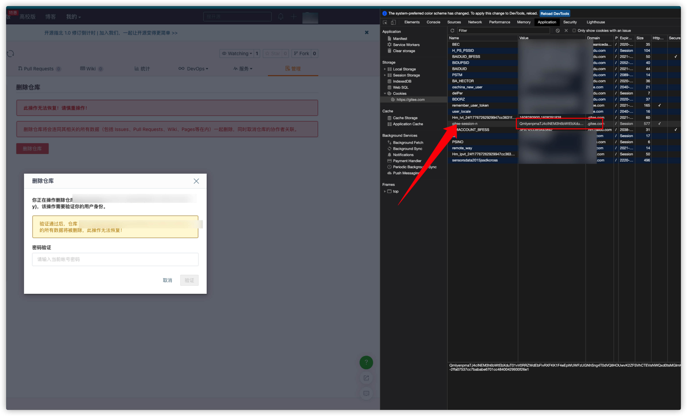

# gitee
批量删除仓库工具
### 1. 安装
安装到`GOPATH`的 `bin`目录.
```
go get -u github.com/wg2019/gitee
```
### 2. 获取token

### 3. 获取cookie

### 4. 填写配置
```
# AccountInfo 账号信息.
[accountInfo]
# Token X-CSRF-Token. 删除一个项目，从请求的headers中
Token = token-string
# Repositories 仓库地址，英文逗号分隔
Repositories = a,b
# 账号名称
UserName = king
# 账号密码
Password = password
# Cookie 从登陆的网址复制下来
Cookie = session-id
```
### 5. 删除项目
```
gitee d
```
